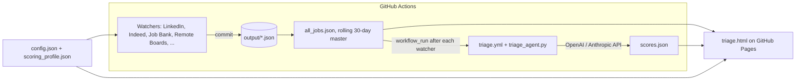

# Job Scraper + AI Triage Dashboard

A free, serverless job-hunting pipeline: **GitHub Actions** scrape job boards on a schedule, an **AI agent scores every new posting against your profile**, and a static **dashboard on GitHub Pages** lets you triage the results. No server, no database, no paid service required (the AI scoring is optional and costs cents).

This fork is tuned for **junior / entry-level remote work**: it filters out senior titles and help-desk queues, screens remote boards for location eligibility, and surfaces a "Best shot" list of the roles the AI rated worth applying to.

- Your dashboard: `https://<your-username>.github.io/Job_Scraper/triage.html`
- Example / mine (a junior, bilingual, Québec-based IT search): <https://gabo2212.github.io/Job_Scraper/triage.html>
- **Want this for your own CV?** Jump to [Make it yours](#make-it-yours-ai-agent-prompt) - paste one prompt into Cursor / Claude Code / Codex and it configures everything.

## Contents

[Credits and what changed](#credits-and-what-changed) · [How it works](#how-it-works) · [Setup](#setup) · [Sync across tabs and devices](#sync-across-tabs-and-devices) · [Make it yours](#make-it-yours-ai-agent-prompt) · [Troubleshooting and FAQ](#troubleshooting-and-faq) · [License](#license)

---

## Credits and what changed

This project is a fork of **[ScottCoffin/Job_Scraper](https://github.com/ScottCoffin/Job_Scraper)** (Scott Coffin), which itself grew out of Ernesto Diaz's Bay Area ML-engineer scraper. The scraper core, the GitHub Actions watcher pattern, the dashboard and the AI-triage idea all come from upstream; this fork builds on them. Upstream's commit history is preserved in this repository.

What this fork upgraded (each item exists in the code or workflows of this repo):

**Sources**
- **Government of Canada Job Bank** source (`--jobbank-only`, `jobbank_watch.yml`), honoring its robots.txt crawl delay.
- **Remote-first boards** (`remote_boards.py`, `--remoteboards-only`, `remote_boards_watch.yml`): Remotive, RemoteOK, We Work Remotely, Himalayas, Jobicy, Working Nomads, Arbeitnow and HN "Who is hiring". Public APIs/RSS only, one request per endpoint, honest User-Agent, link-back to the board.
- **Geo, seniority and scam screening** for those boards (`remote_geo.py`): drops US-only / EU-only / APAC-only / LATAM-only postings, keeps Worldwide / Americas / Canada-friendly ones (unclear ones are tagged `Remote (geo-unclear)`), reads the description for "3+ years" / "senior" vs "junior / graduates welcome", and drops gig-spam. Every board reports raw-vs-kept counts and sample drop reasons in the run log.

**Filtering**
- **Canada / Québec support**: config-driven location filter (`location_filter`), French search terms and title keywords, Canadian LinkedIn geoIds, Canadian Indeed locations, and the dashboard map's fallback point moved from California to Québec (`MAP_FALLBACK` in `triage.html`).
- **Junior-only filtering**: seniority and help-desk/support-queue excludes, plus a junior-signal bypass so ambiguous titles (e.g. "Software Engineer") only pass when the posting shows a junior cue (`_title_is_excluded` in `scrape_jobs.py`).
- **New role buckets** and priority topics in `config.json` (AI-Assisted Dev, Junior Dev / Web, Automation & Scripting, QA, Data, AI Training, Junior Cloud/DevOps, Junior Security, Deployment/Migration).

**AI triage**
- **OpenAI support** (default model `gpt-6-luna`) alongside Anthropic: provider auto-detected from the API keys, or forced with the `TRIAGE_PROVIDER` / `TRIAGE_MODEL` variables.
- **Recalibrated triage prompt** (`triage_agent.py`): target tiers, scoring weights, hard caps (for example US-only <= 20, senior without junior cues <= 35, support queues <= 45), role-family and seniority enums, and **privacy redaction** of personal details from the public `scores.json` fields.
- **AI-assisted development signal**: postings that encourage Copilot / Cursor / "vibe coding" style workflows score higher and are flagged `ai-assisted-dev`; postings that ban AI tools are flagged.
- **Automatic triage after every watcher run** (`workflow_run` trigger in `triage.yml`): new jobs are scored within minutes; a cheap no-op check skips the model call when nothing is unscored. The nightly cron stays as a safety net.
- **"Best shot" dashboard filter**: only the roles the AI rated strong or maybe.
- Tests for the new parsers, screens and workflow wiring (`tests/`), plus a schema update for the new sources.

**Licensing:** upstream is licensed under the **GNU AGPL v3**. The `LICENSE` file is kept unchanged, this fork is published under the same license, and its source is public in this repository (which satisfies AGPL's network-use source requirement for the static dashboard). Changes relative to upstream are visible in the git history. If you fork this repository, keep the `LICENSE`, keep the source public, and keep this credit.

---

## How it works



1. **Watchers** (`*_watch.yml`) run on cron, call `scrape_jobs.py`, keep only titles/locations matching your `config.json`, and commit results to `output/` when the repo variable `ENABLE_DATA_COMMITS` is `true`. All commits share the concurrency group `job-scraper-commit-push` so pushes never collide.
2. Every run merges its new jobs into **`output/all_jobs.json`** (the cumulative master used by everything downstream).
3. **`triage.yml`** starts after any watcher finishes (plus a nightly 09:00 UTC run and manual dispatch). It counts unscored roles with a stdlib-only script; if there are none it stops. Otherwise it scores up to 100 (event runs) or 300 (nightly/manual) roles and commits `output/scores.json`. It never triggers itself and never edits `all_jobs.json`, so it cannot loop.
4. **`triage.html`** is pure client-side JS. It loads `all_jobs.json`, `scores.json`, `config.json` and `scoring_profile.json` at page load - there is no backend.

### Sources

| Source | Flag | Workflow | Notes |
|---|---|---|---|
| Indeed | `--indeed-only` | `indeed_watch.yml` | Works well in CI. Best volume/effort. |
| Job Bank (Canada) | `--jobbank-only` | `jobbank_watch.yml` | Works well. Government of Canada; crawl delay respected. |
| Remote boards (8) | `--remoteboards-only` | `remote_boards_watch.yml` | Works well. Daily; API/RSS only. |
| LinkedIn | `--linkedin-only` | `linkedin_watch.yml`, `linkedin_backfill.yml` | Slow and can hang or rate-limit in CI. Run backfills locally in small chunks. Backfill workflow needs the `CONFIG_JSON` secret (see [Setup](#setup)). |
| Glassdoor, ZipRecruiter | `--glassdoor-only`, `--ziprecruiter-only` | `glassdoor_watch.yml`, `ziprecruiter_watch.yml` | Via `python-jobspy`; frequently blocked or sparse. |
| Google Jobs | `--google-jobs-only` | `google_jobs_watch.yml` | Needs a SerpApi or Oxylabs key in `config.json` / secrets. |
| HiringCafe | `--hiringcafe-only` | `hiringcafe_watch.yml` | Public search route defaults to the United States. |
| USAJOBS, CalCareers, CSU, NEOGOV/CalOpps, priority-employer digest | `--usajobs-only`, `--calcareers-only`, `--csucareers-only`, `--governmentjobs-only`, `--calopps-only`, `--priority-only` | `usajobs_watch.yml`, `calcareers_watch.yml`, `csucareers_watch.yml`, `localgov_watch.yml`, `scrape_jobs.yml` | US/California public-sector sources inherited from upstream. Only useful for US searches; leave disabled otherwise. |

Skipped on purpose (see `remote_boards` in `config.json`): Wellfound (anti-bot wall), Remote.co (no feed), JustRemote (JS-only, no API/RSS), Dynamite Jobs (RSS is a blog, not jobs).

### Key files

| File | Purpose |
|---|---|
| `config.json` | Your search: keywords, exclusions, search terms, locations, role buckets, remote-board settings. Template: `config.example.json` (do not edit it - kept for upstream sync). |
| `scoring_profile.json` | Deterministic keyword fit score used for notifications/sorting. Template: `scoring_profile.example.json`. |
| `scrape_jobs.py` | All scrapers, filters and output writers. |
| `remote_boards.py`, `remote_geo.py` | Remote-board fetchers/parsers and the geo/seniority/scam screens. |
| `triage_agent.py` | AI fit-scoring agent (prompt, providers, redaction). `eval_triage.py` holds golden-case evals. |
| `triage.html` | The dashboard. |
| `tracker-sync.js` | Pure merge/sync logic for your Saved/Applied/notes tracking (unit-tested in `tests/js`). |
| `notify.py` | Optional Pushover notifications and weekly digest. |
| `output/` | Scraped data. `all_jobs.json` is the master; `scores.json` holds AI verdicts. |
| `docs/AGENT_README.md` | Deep dive on the triage agent. `docs/cv-to-config-prompt.md` is the lightweight chatbot variant of the prompt below. |
| `CLAUDE.md` | Short guide for coding agents working in this repo. |

---

## Setup

Requirements: a GitHub account, the [GitHub CLI](https://cli.github.com) (`gh auth login`), Python 3.11+ for local runs, and (optional, for AI scoring) an OpenAI or Anthropic API key.

**1. Fork and clone**

```bash
gh repo fork gabo2212/Job_Scraper --clone
cd Job_Scraper
```

**2. One-command GitHub setup** (bash / Git Bash / WSL; needs `gh`):

```bash
bash scripts/setup.sh
```

It enables Actions, sets workflow permissions to read+write, sets the `ENABLE_DATA_COMMITS` variable, enables Pages and optionally sets the Pushover / Anthropic secrets and triggers a first backfill of the older watchers (run `remote_boards_watch.yml` and `jobbank_watch.yml` yourself). PowerShell equivalents (replace `OWNER/REPO`):

```powershell
gh api repos/OWNER/REPO/actions/permissions --method PUT --field enabled=true --field allowed_actions=all
gh api repos/OWNER/REPO/actions/permissions/workflow --method PUT --field default_workflow_permissions=write
gh variable set ENABLE_DATA_COMMITS --body "true"
gh api repos/OWNER/REPO/pages --method POST --field "source[branch]=main" --field "source[path]=/"
```

Forks start with scheduled workflows disabled; enable the ones you want (`gh workflow list --all`, then `gh workflow enable <file>`). Then run **Actions -> Validate Setup** to check the configuration.

**3. Replace the example owner's search with yours.** A fork of this repository inherits *its owner's* `config.json`, `scoring_profile.json`, the `output/` data and `output/scores.json`. Overwrite the two config files with your own (edit by hand starting from `config.example.json`, or let an AI agent do it from your CV: see [Make it yours](#make-it-yours-ai-agent-prompt)), then reset the data so you are not looking at someone else's jobs and scores:

```bash
gh workflow enable clear_data.yml && gh workflow run clear_data.yml   # empties output/*_jobs.json, all_jobs.json, notified.json
git rm output/scores.json           # clear_data.yml does not remove AI verdicts
git add config.json scoring_profile.json
git commit -m "chore: personalize search"
git pull --rebase origin main && git push
```

`config.json` and `scoring_profile.json` are gitignored upstream (so upstream merges never touch them) and marked `merge=ours` in `.gitattributes`; if yours are untracked, use `git add -f`. If you start from upstream instead of this fork, there is nothing to clear.

**4. Secrets and variables** (Settings -> Secrets and variables -> Actions):

| Name | Type | Required | Purpose |
|---|---|---|---|
| `ENABLE_DATA_COMMITS` = `true` | Variable | Yes | Lets watchers commit results. |
| `OPENAI_API_KEY` or `ANTHROPIC_API_KEY` | Secret | For AI triage | Provider is auto-detected (OpenAI preferred). |
| `CANDIDATE_PROFILE`, `CANDIDATE_RESUME` | Secret | For AI triage | Your profile and resume text. Only ever stored as secrets. |
| `TRIAGE_PROVIDER`, `TRIAGE_MODEL` | Variable | No | Force `openai`/`anthropic` or a model (default `gpt-6-luna`). |
| `CONFIG_JSON` | Secret | Only for `linkedin_backfill.yml` | Single-line ASCII copy of `config.json`: `bash scripts/export-config-secret.sh`. |
| `PUSHOVER_TOKEN`, `PUSHOVER_USER` | Secret | No | Phone notifications. |

Set a multi-line secret without putting it on disk in the repo (PowerShell; keep the source files outside the repo):

```powershell
Get-Content -Raw -Encoding utf8 "$HOME\private\candidate_profile.md" | gh secret set CANDIDATE_PROFILE
Get-Content -Raw -Encoding utf8 "$HOME\private\resume.md"            | gh secret set CANDIDATE_RESUME
```

bash: `gh secret set CANDIDATE_PROFILE < ~/private/candidate_profile.md`. Editing a secret does not trigger workflows; after changing the profile, run **Triage Agent Evals** manually.

**5. First run.** Trigger a backfill so the dashboard is not empty (Actions -> a watcher -> Run workflow -> `backfill: true`, or `gh workflow run remote_boards_watch.yml -f backfill=true`). Open your dashboard URL once Pages has built (about a minute).

### Run locally

```bash
pip install -r requirements.txt            # python-jobspy: Indeed/Glassdoor/ZipRecruiter/Google
python scrape_jobs.py --indeed-only        # or --linkedin-only, --jobbank-only, --remoteboards-only, ...
python -m http.server 8000                 # then open http://localhost:8000/triage.html

pip install openai                          # or: pip install anthropic
python triage_agent.py --dry-run            # show what would be scored
python triage_agent.py --limit 50           # score (needs OPENAI_API_KEY/ANTHROPIC_API_KEY + CANDIDATE_PROFILE)
python eval_triage.py                       # golden-case evals against the real model

pip install -r tests/requirements-dev.txt
python -m pytest tests -q
```

Windows: set env vars with `$env:OPENAI_API_KEY = "..."` (never paste a key into chat or commit it), and `$env:PYTHONUTF8 = "1"` if you hit encoding errors.

### Add a source

1. Add a `--<name>-only` flag and a scraper in `scrape_jobs.py` (reuse `_title_is_excluded`, `is_target_location`, `classify_work_arrangement`). Use `scrape_jobbank_recent` / `scrape_remoteboards_recent` as templates.
2. Write to `output/<name>_jobs.json` (+ `.md`/`.html`) and merge into `all_jobs.json` via the existing save helpers.
3. Copy a simple watcher (e.g. `jobbank_watch.yml`), keep the `job-scraper-commit-push` concurrency group and the `ENABLE_DATA_COMMITS` gate, and add its `name:` to the `workflow_run` list in `triage.yml`.
4. Add the new `ats` value to `schema/jobs.schema.json`, and parser tests with saved fixtures (mock the network).

### Cost and privacy

- **Cost:** with `gpt-6-luna` (about $0.10 / $0.50 per million input/output tokens per OpenAI's pricing page; check current prices) scoring one posting is a fraction of a cent, and already-scored roles are never re-billed. `--limit` caps each run, `--no-jd` skips job-page fetches. Actions minutes are free on public repos.
- **The repo is public, and so are GitHub Pages outputs.** `output/*`, `scores.json`, `config.json` and `scoring_profile.json` are served to anyone. Keep personal details out of them.
- `CANDIDATE_PROFILE` / `CANDIDATE_RESUME` exist only as Actions secrets (env vars at runtime); the agent never writes them to disk. `.gitignore` blocks `resume*`, `cv*`, `*.pdf`, `candidate_profile.md` and similar - do not override it.
- The triage prompt forbids names, employers, schools, dates and resume numbers in the public fields, and `triage_agent.py` additionally strips derived private tokens (`redact_private`) before writing `scores.json`. Job-description text is treated as untrusted input.
- Stay polite to boards: keep the request delays in `config.json`, do not lower them.

### Sync across tabs and devices

Your tracking (Saved / Applied / Interview / Offer, star ratings, notes, logged events, blocked companies) is stored in the browser, not in the repo.

- **Tabs in the same browser** stay in sync automatically (`BroadcastChannel`, with the `storage` event as a fallback). Every write is applied as a diff on top of the latest stored data, so a stale tab can no longer overwrite another tab's edits. Open tabs update within about a second and on focus.
- **Phone / other computers** are opt-in via the **Sync** button in the header. The data goes into a **secret GitHub Gist in your own account** (one file, `job-tracker-state.json`, description `job-tracker-sync`):
  1. [Create a classic token with ONLY the `gist` scope](https://github.com/settings/tokens/new?scopes=gist&description=job-tracker-sync) (nothing else ticked; pick an expiry).
  2. Desktop: Sync → paste the token → **Connect**. The dashboard finds or creates the gist and merges what it finds.
  3. Sync → **Copy phone setup link**, open it once on your phone. The link holds the token in the URL fragment (`#sync=…`; fragments are never sent to a server) and the page strips it from the address bar right after importing. Don't save or share that link.
- Merge rule: per field, the newest edit wins (by timestamp); logged events are merged as a union, deletions are tombstones, so two devices editing offline converge without losing each other's work. Keep device clocks correct. Default is **Off**; the dashboard works the same with no network.

**Privacy and trade-offs.** A *secret* gist is unlisted but **not access-controlled**: anyone with its URL can read it, so don't put anything in notes you would not be OK with that. The state never goes to this repo. The token is kept in `localStorage` on each connected device (readable by anything that runs on that origin and by anyone with the device), is only ever sent to `api.github.com`, and is never logged or committed; revoke it at <https://github.com/settings/tokens> if a device is lost. Sync errors (expired token, missing `gist` scope, rate limit, offline) are shown in the panel. Sturdier alternatives, if you outgrow this: a Cloudflare Worker + KV endpoint with your own auth, or a private repo file behind a fine-grained token.

Tests: `node --test tests/js` (merge logic, mocked Gist API; also run by pytest) and `tests/local/browser_verify_sync.py` (manual Playwright check with a mocked API).

### Stay in sync with upstream

`sync_upstream.yml` merges `ScottCoffin/Job_Scraper` weekly with `-X ours` so your `config.json` / `scoring_profile.json` always win. Use it instead of GitHub's "Sync fork" button (which can offer to discard your commits). It tracks Scott's repository, not this fork; to follow this fork's newer features, merge from `gabo2212/Job_Scraper` manually.

---

## Make it yours: AI agent prompt

Open this repository (your fork, cloned) in a coding agent (Cursor, Claude Code, Codex), attach or point to your CV, paste the prompt below, and answer its questions. It turns this site into a version specific to you, using only your CV plus whatever extra info you give it.

**Answer these up front to get a better result** (all optional; say "unknown" to skip):
1. Target roles and the ones you refuse (e.g. "no help desk", "no sales").
2. Seniority: junior / mid / senior; years of real experience; degree or equivalence.
3. Where you can work: remote-only or on-site/hybrid cities, countries/regions, time zones, relocation, visa or work-authorization limits.
4. Languages you work in (search terms are generated in each).
5. Salary floor, contract vs permanent, freelance/project-based preference.
6. Tech you want to use or avoid; do you prefer roles that allow or encourage AI-assisted coding?
7. Employers to prioritize or exclude; industries to avoid.
8. Whether your name may appear on the public dashboard title (default: no).
9. Which AI provider you have (OpenAI or Anthropic) and whether the repo is already forked.

Full prompt (copy everything in the block):

````text
ROLE
You are a careful engineer personalizing a fork of the Job_Scraper repository (GitHub Actions scrapers + AI fit-scoring + static GitHub Pages dashboard) for ONE person, using only their CV plus the extra info they give you. Work in the current repo. The owner will review before anything is pushed.

INPUTS
- CV: a file path or pasted text the user provides. If none is provided, ask for it and stop.
- EXTRA INFO (optional): target roles, refused roles, seniority/years, location and remote rules, work authorization, languages, salary, preferred/avoided tech, AI-assisted-coding preference, employers to target/avoid, whether their name may appear on the dashboard.
- If anything that changes the search materially is missing or contradictory (seniority, location eligibility, languages, refused roles), ask concise questions first. Never guess qualifications.

HARD RULES (non-negotiable)
1. FACTS ONLY. Use only facts from the CV and extra info. Never invent or inflate qualifications, years, degrees, employers or skills. List gaps and ambiguities for the user at the end.
2. PRIVACY. The repo is public and GitHub Pages serves config.json, scoring_profile.json, output/* and scores.json. Do not put the user's name, employers, schools, dates, phone, email, address, or CV text in ANY tracked file (including config.json "_README"/profile fields, eval cases, tests, docs, commit messages, logs). Dashboard title/subtitle describe the search (for example "Junior Remote Dev / Automation - Québec"), not the person, unless the user explicitly allowed their name.
3. SECRETS. CANDIDATE_PROFILE and CANDIDATE_RESUME contents live only in GitHub Actions secrets. Write their source files OUTSIDE the repo (for example a private folder in the user's home directory), set them with `gh secret set` from stdin or a file (PowerShell: `Get-Content -Raw -Encoding utf8 <file> | gh secret set NAME`), and never print, commit or echo them. Never print API keys. If the user pasted a key into chat, tell them to rotate it after setup. Never run `git config`. Never `git add -f` the CV, profile or resume files.
4. SCOPE. Edit only files that should be personalized: config.json, scoring_profile.json, the calibration sections of triage_agent.py (see below), eval_triage.py golden cases, the geo constants in remote_geo.py when the user is not Canada-based, the MAP_FALLBACK [lat, lng] constant in triage.html (only that line), and the related tests. Do not edit config.example.json or scoring_profile.example.json. This fork ships with ITS PREVIOUS OWNER'S config.json, scoring_profile.json, output/* data and output/scores.json: overwrite/replace all of them, strip the previous owner's name and details from config.json (including "_README" and profile.title), and never reuse their profile wording. Do not refactor unrelated code.
5. NO MONEY, NO AUTO-APPLY. Do not sign up for paid services, buy anything, or submit job applications. Do not raise scrape frequency or remove request delays; be polite to job boards.
6. CONFIRM BEFORE EXTERNAL ACTIONS. Show the user a summary of the planned changes and wait for approval before pushing to GitHub, setting secrets, or enabling workflows.

STEP 1 - READ THE REPO
Read README.md, CLAUDE.md, docs/AGENT_README.md, docs/cv-to-config-prompt.md, config.example.json, scoring_profile.example.json, triage_agent.py (build_static_prefix, ROLE_FAMILIES, SENIORITY_FITS, FLAG_TAGS), eval_triage.py (CASES), remote_geo.py (classify_location and region regexes) and scrape_jobs.py (_title_is_excluded, is_target_location, classify_work_arrangement). Run `python -m pytest tests -q` to record the baseline.

STEP 2 - PROFILE THE PERSON
Write a short internal profile: target role families in priority tiers (T1 best fit, T2 adjacent, T3 acceptable), seniority band (and what counts as a junior/entry signal), education facts, languages, location/remote eligibility rules, refused roles, tech to boost/avoid, AI-assisted-coding stance, employers to target/avoid. Show it to the user and get corrections.

STEP 3 - PRODUCE THE FILES
a) config.json (start from config.example.json; keep its structure):
   - profile: generic title/subtitle/emoji (no name unless allowed).
   - keywords.include: 40-150 full job-title phrases in EACH of the person's languages; keywords.exclude: seniority terms (senior, lead, staff, principal, manager, director, head of, architect), intern/co-op/student if not wanted, refused roles, and known false-positive substrings. Ambiguous nouns (engineer, specialist, consultant, analyst, coordinator, associate) must NOT pass on their own for a junior searcher: rely on the junior-signal bypass in _title_is_excluded and add junior/entry cues ("junior", "entry level", "graduate", "new grad", "0-2 years", and the language equivalents). Use word boundaries for short acronyms so substrings do not leak (for example "SOC" must not match "Associate").
   - search_terms.* per source (linkedin ~15-25, indeed/glassdoor/ziprecruiter/google_jobs/hiring_cafe ~6-10, job_bank in each official language if applicable, remote_boards queries), written the way recruiters write titles, in the person's languages.
   - locations.* per source in each source's format, and locations.linkedin[].geoId for the target regions (verify a geoId by checking that a LinkedIn search returns jobs from the right place; leave "" if unsure). location_filter.terms must list every target region spelled as it appears in postings (local-language spellings, abbreviations, major cities).
   - remote_boards: boards, max_age_days, Himalayas country code, Jobicy geos, We Work Remotely feeds matching the target roles.
   - employers.priority / employers.exclude, priority_topics and role_categories (5-10 regex buckets, most specific first; JSON-escape backslashes), notify.min_fit.
   - Remove upstream sources/terms that do not apply (for example US public-sector boards for a non-US user) and leave their workflows disabled.
b) scoring_profile.json: fit_terms (weighted regexes for the person's strong-fit skills/titles, junior and AI-assisted terms if relevant), signature_terms, poor_fit_terms (penalties for refused roles, senior cues, required-years patterns) and settings. Validate that it loads: `python -c "import notify"` prints the rule counts without warnings.
c) triage_agent.py calibration. Edit ONLY the personalizable parts of build_static_prefix and the enums: the opening line describing the candidate, target tiers, out-of-scope list, scoring weights, hard caps, seniority/education rules, the location rubric (best/strong/acceptable/penalty/automatic-skip cases for THIS person's region and work authorization), the avoid-list, and ROLE_FAMILIES / FLAG_TAGS to match the person's roles and region. Preserve unchanged: the required JSON output shape, the privacy rule for public fields, the untrusted-job-description rule, the profile-vs-resume and never-invent-facts rules, redact_private and private_tokens. Keep the prompt free of the person's name and CV specifics (those come from the secrets at runtime). Update tests/test_triage_provider.py or other tests that assert the old prompt wording.
d) Secret contents (written OUTSIDE the repo): CANDIDATE_PROFILE is a short markdown profile using the canonical role-family tokens, facts only; CANDIDATE_RESUME is the CV as plain text or markdown, under 48 KB. Do not store them in the repo.
e) remote_boards geo screens: if the person is not Canada-based, adapt remote_geo.py (eligible regions, region regexes, the non-target lists) and keep its tests passing; if unsure, tell the user.

STEP 4 - TESTS AND EVALS
- Regenerate eval_triage.py golden cases for this person (synthetic postings only, no real employer or person data): at least one strong fit, one too-senior role, one refused role, one wrong-location role, one mandatory-degree/years mismatch, one prompt-injection-in-JD case, one metadata-only case. Update fixtures/tests that hard-code the previous owner's profile.
- Run `python -m pytest tests -q` and `python eval_triage.py` (needs an API key and CANDIDATE_PROFILE in env; never print them). Fix failures in the implementation or in tests that encode the old persona; do not weaken a test just to pass.

STEP 5 - GITHUB SETUP (after the user approves)
- Ensure the user has their own fork (`gh repo fork gabo2212/Job_Scraper --clone` if not), use `gh -R OWNER/REPO` when several remotes exist.
- Set repo variable ENABLE_DATA_COMMITS=true, workflow permissions to read+write, Pages from main /, secrets (OPENAI_API_KEY or ANTHROPIC_API_KEY, CANDIDATE_PROFILE, CANDIDATE_RESUME) by prompting the user to set the API key themselves; optional TRIAGE_PROVIDER / TRIAGE_MODEL variables; CONFIG_JSON only if they will use linkedin_backfill.yml (`bash scripts/export-config-secret.sh`).
- Reset inherited data: dispatch clear_data.yml and delete output/scores.json (stale verdicts from another profile must not survive).
- `gh workflow enable` only the watchers that apply to the person (typically indeed_watch, remote_boards_watch, jobbank_watch if in Canada, linkedin_watch, triage). Commit config.json and scoring_profile.json with `git add` (add `-f` only if they are untracked). Do NOT force-add the CV, profile or resume files or anything under output/ by hand; CI commits output/ itself. Use `git pull --rebase origin main` before pushing; conventional commit messages (`feat:`, `fix:`, `chore:`).

STEP 6 - BACKFILL AND QUALITY LOOP
- Run backfills in small chunks. LinkedIn hangs or rate-limits in CI and on long runs: run it locally with a small term/location list and a time limit, or skip it. Indeed, Job Bank and the remote boards are reliable in CI.
- Inspect the results (output/all_jobs.json): sample 30-50 titles per source and check seniority, location eligibility, refused roles and non-target noise. For every bad sample, tighten keywords.exclude, junior-signal handling, location_filter, or the geo screens, re-run, and repeat until the list is relevant. Record raw-vs-kept counts and drop reasons per source.
- Let triage run (it starts automatically after each watcher via workflow_run, or dispatch triage.yml). Confirm 0 scoring errors, sane score distribution, and that the strong/maybe list ("Best shot") contains roles the person would actually apply to.
- Check the dashboard in a real browser (local `python -m http.server` and the Pages URL): filters, Best shot, map, no console errors, and no personal data visible on the page or in the raw JSON files.

STEP 7 - FINAL REPORT
Give a concise report: what files changed; counts per source (raw, kept, new); 10-15 sample matches with scores; quality-loop changes you made; open gaps or assumptions needing the user's confirmation; manual actions left (set the API key, enable Pages if it failed, dispatch evals after profile edits); a reminder to rotate any key that was ever pasted into chat; and anything you could not verify.

PLATFORM NOTES
- Windows PowerShell has no heredocs and different quoting: write scripts to a temp file outside the repo instead of inline one-liners with nested quotes; set `$env:PYTHONUTF8 = "1"` for Python scripts reading UTF-8 JSON.
- Prefer `gh` for GitHub actions and always confirm the target repository (forks have several remotes).
````

**One-liner variant** (for a capable agent that has already read this README):

````text
Read README.md and docs/cv-to-config-prompt.md, then personalize this repo for me from my CV at <path or paste>, following the "Make it yours" prompt rules: facts only, no personal data in tracked files, secrets only via gh secret set from files outside the repo, edit config.json / scoring_profile.json / the triage prompt calibration / evals only, ask me before pushing or setting secrets, run backfills and the quality loop, run tests and evals, and end with a report. Extra info: <roles, seniority, location/remote rules, languages, avoid-list, AI-assisted preference>.
````

The chatbot-only variant (config.json only, no repo access) is in [`docs/cv-to-config-prompt.md`](docs/cv-to-config-prompt.md).

---

## Troubleshooting and FAQ

**Dashboard is empty.** Check that Pages is enabled (main, `/`), `ENABLE_DATA_COMMITS` is `true` (Variables tab, not Secrets), workflow permissions are read+write, and at least one watcher ran (Actions tab). Run **Validate Setup**.

**A workflow is `disabled_fork` or `disabled_manually`.** Forks start with workflows disabled: `gh workflow enable <file> -R OWNER/REPO`.

**No AI scores.** Triage needs `OPENAI_API_KEY` or `ANTHROPIC_API_KEY` plus `CANDIDATE_PROFILE`; without them the run fails or the dashboard shows unscored jobs. Check the "Count unscored roles" step: `unscored roles: 0` means nothing is waiting.

**Triage ran twice / a run was cancelled.** Watchers and the triage commit job share one concurrency group (one running, one pending). A cancelled commit only means those roles are scored again next run.

**LinkedIn hangs or returns little in CI.** Expected; run `python scrape_jobs.py --linkedin-only` locally or rely on Indeed/Job Bank/remote boards.

**Too many senior / support / irrelevant jobs.** Add to `keywords.exclude`, tighten `keywords.include`, then dry-run by checking `output/all_jobs.json`. Short words need word-boundary regexes.

**Wrong-country remote jobs.** The remote-board geo screen in `remote_geo.py` is written for a Canada-based candidate; adapt it if you are elsewhere (the agent prompt does this). Likewise the map's fallback point is set by `MAP_FALLBACK` in `triage.html`, and the triage prompt in `triage_agent.py` describes a Québec-based junior IT candidate until you recalibrate it.

**Will my CV become public?** Not if you follow the setup: it only lives in Actions secrets and is sent to your chosen AI provider at scoring time. Anything in `config.json`, `scoring_profile.json`, `output/*` and `scores.json` is public.

**Is scraping allowed?** Each site has its own terms. Remote boards are read through public APIs/RSS with link-back; LinkedIn/Indeed/Glassdoor/ZipRecruiter scraping is a grey area - use at low volume, for personal use, and at your own risk.

---

## License

GNU Affero General Public License v3.0 - see [`LICENSE`](LICENSE). Original work: [ScottCoffin/Job_Scraper](https://github.com/ScottCoffin/Job_Scraper) (Scott Coffin), itself derived from Ernesto Diaz's scraper; this fork's additions are released under the same license. Job data belongs to the respective boards and employers.
